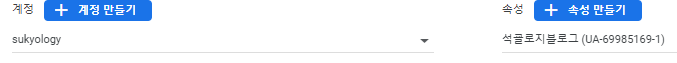
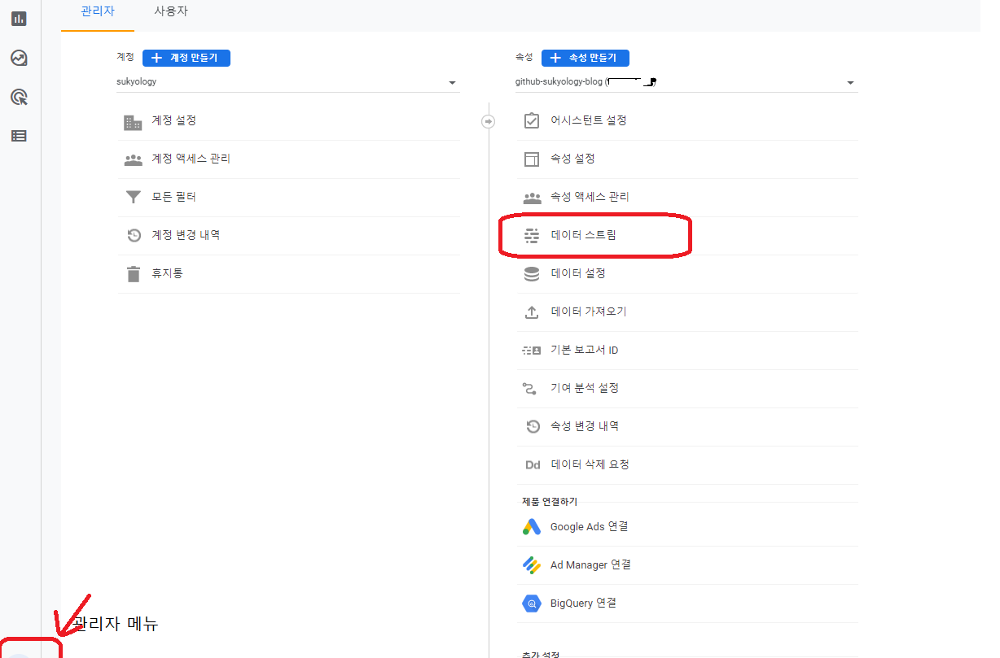
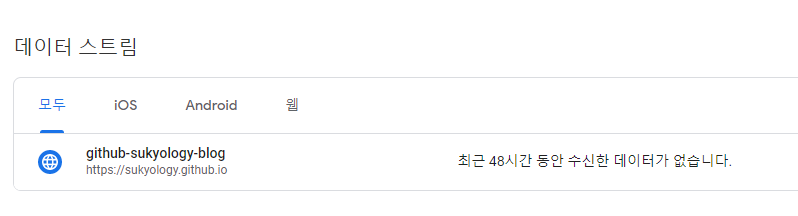
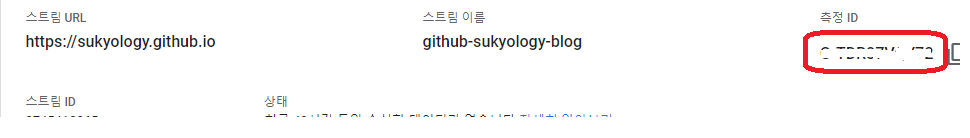
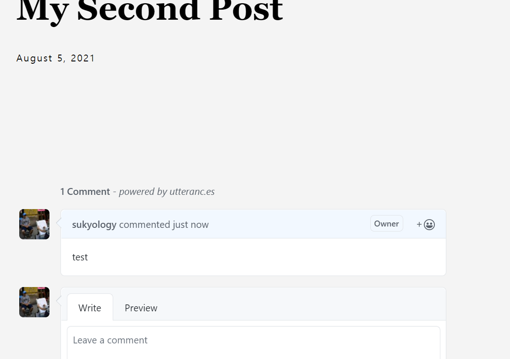

## 2021-08-14

### ga 적용
<br>
처음에 댓글을 적용하고 나니까, 다 끝난 줄 알았는데, 생각해보니 조회수 기록을 측정할 수가 없어서 
*아... 그냥 블로그 서비스를 이용해서 작성해야 하나...* 라는 생각을 했다. 하지만, 가장 중요한 조건인 게시물을 내가 소유한다는 느낌을 만족시키지 못하기 때문에 생각을 돌렸다. 깃헙에 마크다운을 작성하고, 깃헙 액션을 통해 블로그 서비스에 배포하는 방식도 생각해봤지만, 정적 사이트에 google analytics를 다는 게 훨씬 더 합리적인 생각이 들어서 ga를 적용하기로 했다. 

<br>

hugo는 ga를 내부 template을 통해서 지원해준다.  

영어가 편하신 분은 [gohugo#google-analytics](https://gohugo.io/templates/internal/#google-analytics) 에서 보시길 추천한다.

theme 이 없다는 가정하에 다음과 같이 적용할 수 있다. 

`<head>`엘레멘트가 있는 layout html파일에 `{{ template "_internal/google_analytics.html" . }}` 을 적용하고, 설정파일(.toml 이라고 가정)  에 `googleAnalytics = <구글_애널리틱스_속성_ID>` 를 입력하면 끝이다. 

<br>

그럼에도 몇가지 삽질을 했다. 

1. theme에서 `{{ template "_internal/google_analytics.html" . }}`을 적용할 때 production에서만 적용하도록 분기문이 적용되어 있었다. 내가 쓰는 [ananke](https://github.com/theNewDynamic/gohugo-theme-ananke)에서 production 판별 조건 중 하나가 `HUGO_ENV=production`이었는데, HUGO cli에서 `-e` 로 세팅할 수 있는 줄 알았는데, 아니었다. 

   > 또, `{{ template "_internal/google_analytics_async.html" . }}` 로 적용되어 있었는데, _async를 v4에서는 빼줘야 한다. 

2. google analytics에서 속성 ID를 생성할 때 v3과 v4의 위치가 다르다. v4를 생성할 때 v3 아이디가 있던 곳에 숫자들이 당연히 아이디일 줄 알았는데, 아니었다. 

   v3는 

   는 관리 페이지 속성에 아이디가 적혀있는데, v4는 해당 위치에 적혀있는 숫자 대신 아래의 사진에 있는 데이터 스트림을 클릭한다.

   

그럼 아래와 같이 스트림 목록이 나오는데,

 

원하는 스트림을 클릭한 다음에



측정ID 항목에 있는 값이 설정 파일에 넣어야 하는 값이다. 


## 2021-08-11

### 댓글 달기 기능 추가
<br>
disqus를 적용해보려고 했는데, 무슨 이유에서인지 잘 되지를 않았다.
그래서 뭐 이런 저런 것들을 찾아봤는데... 
disqus에 대해 부정적인 얘기를 들었다. 그러다가 어느 블로그를 들렀는데,
깃헙 계정으로 댓글을 달 수 있는 걸 볼 수 있었다. 

그래서 뭔가 하고 찾아봤더니, 블로그 댓글 기능을 깃헙 이슈를 생성하고, 
거기에 달린 댓글로 블로그 댓글에 보여주는 깃헙 앱을 누가 만들었던 것이다.
사용법은 굉장히 간단하다.
https://utteranc.es/?installation_id=18785326&setup_action=install

위에 사이트를 가서, 
1. 내 블로그 리파지토리하고,
2. issue와 블로그 글의 연동 방식,
3. 댓글에 적용할 theme

을 선택하면

```html
<script src="https://utteranc.es/client.js"
repo="sukyology/sukyology.github.io"
issue-term="pathname"
theme="github-light"
crossorigin="anonymous"
async>
</script>
```
이런 식으로 script element가 생성된다. 
해당 script는 깃헙 issue 댓글들을 html로 만들어서
`<div class="utterances"></div>`의 chidren에 주입한다.
내 블로그 글에 적용되는 template html에 위치를 정해서
```html
<div class="utterances"></div>
<script src="https://utteranc.es/client.js"
        repo="sukyology/sukyology.github.io"
        issue-term="pathname"
        theme="github-light"
        crossorigin="anonymous"
        async>
</script>
```
이런 식으로 만들어서 적용하면

댓글 쓰기 기능이 생긴다. 

> 댓글 기능 추가하느라 고생한 부분이 있는데... 
> theme을 적용할 경우, 해당 theme에서 제공하는 layout을 
> override 해야 한다. 대부분 게시글에 대한 layout은 /theme/{theme_name}/layouts/_default/single.html 파일로 저장되는 것 같다. 
> /theme/{theme_name}만 빼고 나머지 파일 경로는 겹치게 해서 생성하면 해당 파일이 theme layout을 override한다. 
> 해당 파일에 내용을 작성하거나 수정하면 그대로 반영이 된다. 주의할 것은 처음 override할 때는 반드시 서버를 내렸다 올려야 적용이 된다.

