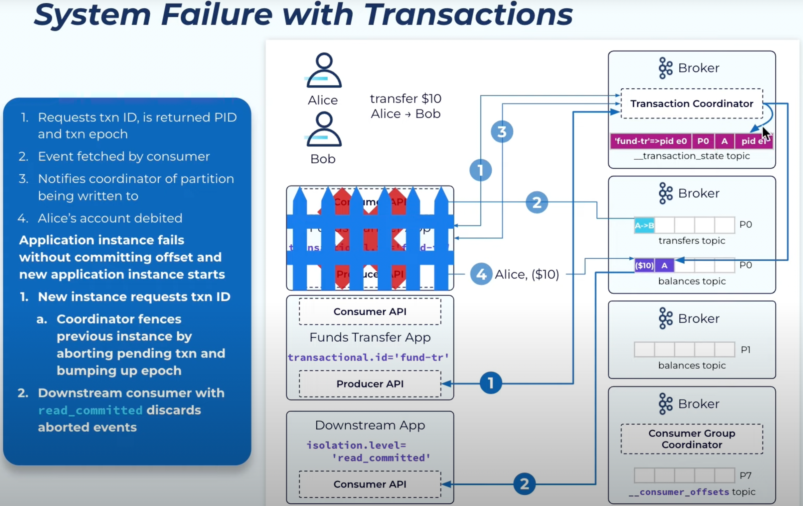
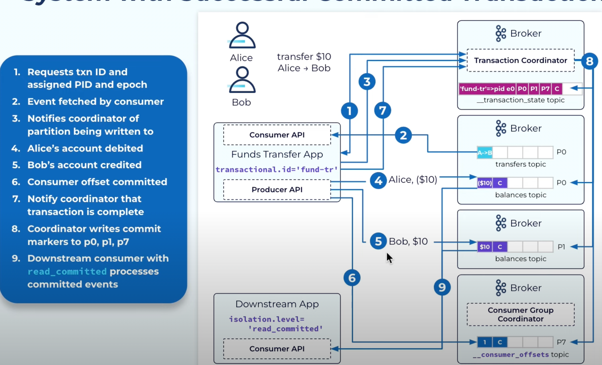

## 서론

exactly-once message delivery 과정에서 어떤 문제가 생길 수 있는지 알아보고 
kafka transaction 처리가 어떤 방식으로 그 문제를 해결하는지 알아보자.
> 해당 글에서 write-produce와 read-consume은 서로 같은 의미로 썼습니다.

## 왜 transaction이 필요할까?

점차 많은 사람들이 카프카를 사용하면서 read-process-write 과정에서 exactly-once 기능의 지원을 필요로 했다.
A 메세지의 consume이 B 메세지의 publish라는 필요충분 조건을 만족시켜야 했다는 말이다.

일반적인 at-least-once 프로듀서와 컨슈머로는 다음 상황들로 인해 exactly-once read-process-write(**rpw**)을 만족시키는 application을 만들 수 없다.

1. producer의 중복 요청 : 이는 위에 언급한 producer에서 멱등성 유지를 위한 sequence 번호 부여로 해결가능하다.
2. A 메세지를 consume 했음에도 처리 기록을 못하고 다운될 경우 processing 에 중복이 발생해서 B 메세지 중복 발행이 가능하다
3. 순간적인 장애로 fault tolerance 해결하는 과정에서 새로운 인스턴스들이 생성되고,
   살아돌아온 구 인스턴스와 새로운 인스턴스가 처리 시도를 하면서 B 메세지 중복 발행이 가능하다

2,3번 문제 해결을 해야만 exactly-once rpw이 가능한 상황이다.

## exactly-once?

### producer
프로듀서와 브로커가 상호 작용할 때 서로 단독으로 실패할 수 있는데, 
이를 어떻게 처리하냐에 따라 메세지 딜리버리의 의미가 달라진다.

브로커가 메세지를 받으면 프로듀셔에게 ack를 응답하는데, 
브로커가 메세지를 받은 후 ack를 보내기 직전에 에러가 날 수 있다. 
이 경우에 프로듀서가 메세지 전송 재시도를 하도록 설정하면 at-least-once (최소한번), 
재시도를 안하게 설정하면 at-most-once (최대한번) 이다.
exactly-once의 경우 기본적으로 at-least-once로 동작하는데, 
추가로 메세지에 sequence 번호를 넣어서 보내고, 브로커는 수신한 메세지의 sequence 번호를 기존 수신 기록과 대조해서
중복 확인을 한다. 

사용법은 굉장히 간단하다. 
`enable.idempotence=true` 만 추가하면 exactly-once를 달성할 수 있다.
주의사항은 `acks` 설정을 `all`외로 바꿀 경우 에러가 난다.

>acks란?
> 
> producer는 acks 설정값으로 `0, 1, all`중 하나를 부여할 수 있는데,
> 0은 broker의 수신 결과를 신경쓰지 않습니다. 1은 카프카 리더 브로커의 수신 여부를 확인합니다. 
> all은 카프카 리더 브로커가 수신하고 레플리카에 복제까지 했는지 확인하고서야 해당 메세지가 잘 전송되었다고 판단합니다.

```
enable.idempotence=true
#하기의 default 설정이 적용된다.
acks=all
max.in.flight.requests.per.connection=5
retries=2147483647
```

### consumer

consumer는 수신 기록을 consumer-offset 라는 특수한 토픽에 기록하는데,
consumer가 메세지 수신 후 
선 로그 기록, 후 메세지 처리를 할 경우 at-most-once, 
선 메세지 처리, 후 로그 기록 시 at-least-once 이다.

consumer가 exactly-once 를 달성하기 위해서는 처리가 조금 복잡해지는데, 
kafka는 transaction 기능 지원을 통해 이 문제를 해결한다.


## kafka transaction semantic

transaction은 복수의 topic과 partition에 대한 메세지 쓰기를 원자 단위로 가져갈 수 있게 한다. (atomic write)
그리고 복수의 topic과 partition에 대해 atomic write이 가능하다면 이는 atomic read-process-write를 가능하게 한다.
>kafka는 read 처리를 별도의 topic(consumer-offset)에 write하는 것으로 처리하고 있기 때문에, 복수의 topic에 atomic write이 가능하다는 말이 
> read-process-write을 atomic 하게 한다는 것과 같습니다.


## kafka의 transaction은 exactly-once read-process-write(rpw)을 어떻게 지원하는 걸까? 

exactly-once rpw 과정을 간단하게 얘기하면
특수한 모듈이 동시 write되어야 하는 각 topic의 메세지에 transaction 진행중/성공/실패 라는 기록을 남기고,
해당 topic의 consumer들은 해당 마킹에 따라서 log를 consume할지 말지를 정한다. 

해당 기능이 조금은 trick이라고 생각할 수 있는 게 실제 토픽에 메세지가 쓰였지만, 
consumer가 마킹에 따라서 거를 수 있게 만듬으로서
메세지가 기록이 되더라도 기록되지 않은 것처럼 시스템이 동작할 수 있게 한 것이다.

### 구체적으로... 

#### 실패시

1. kafka는 application은 kafka에 transactional.id를 등록한다. 그에 따라 PID와 epoch을 기록한다.
2. read한다.
3. coordinator라고 하는 특수한 모듈에게 transaction내에 포함되어 있는 topic들을 알린다.
4. 메세지를 produce한다. 
5. 중간에 오류가 나면서 새로운 인스턴스가 생성되고, 시작하면서 transactional.id를 등록하려고 한다. 
6. coordinator는 기존 transactional.id에 대응하는 PID와 epoch으로 진행하던 transactio기록을 abort하면서 모든 topic에 실패 기록을 남긴다.

    동시에 epoch을 bump up 하면서 이전에 오류가 났던 인스턴스가 재기동을 해도 동작 못하도록 막는다. 
7. `read_committed` 라는 설정이 적용된 consumer는 topic에서 abort 기록을 확인하고 해당 메세지는 읽지 않는다. 

#### 성공시

1. kafka는 application으로부터 transactional.id를 요구하고 그에 따라 PID와 epoch을 기록한다.
2. read한다. 
3. coordinator라고 하는 특수한 모듈에게 transaction내에 포함되어 있는 topic들을 알린다.
4. transaction내에 포함된 topic에 메세지 produce
5. 또다른 topic에 메세지 produce
6. consumer offset topic에 메세지 프로듀스
7. coordinator에 성공 내용 전달
8. coordniator는 각 topic에 transaction 성공 마킹 (`TODO` 이 과정에서 오류가 안난다는 보장은?)
9. `read_committed` 적용한 conumer들은 topic에서 commit 기록을 확인하고, 해당 메세지를 읽는다.

## read-process-write이 아닐때는?
process 과정에서 멱등성 보장을 알아서 해줘야 한다. ㅠㅠ

## 참고자료
- https://developer.confluent.io/tutorials/message-ordering/kafka.html
- https://www.popit.kr/kafka-운영자가-말하는-producer-acks/
- https://www.youtube.com/watch?v=Ki2D2o9aVl8
- https://www.confluent.io/blog/transactions-apache-kafka/
- https://www.confluent.io/blog/exactly-once-semantics-are-possible-heres-how-apache-kafka-does-it/
- https://kafka.apache.org/documentation/#semantics
- https://developer.confluent.io/learn/kafka-transactions-and-guarantees (TODO - read)
