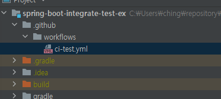
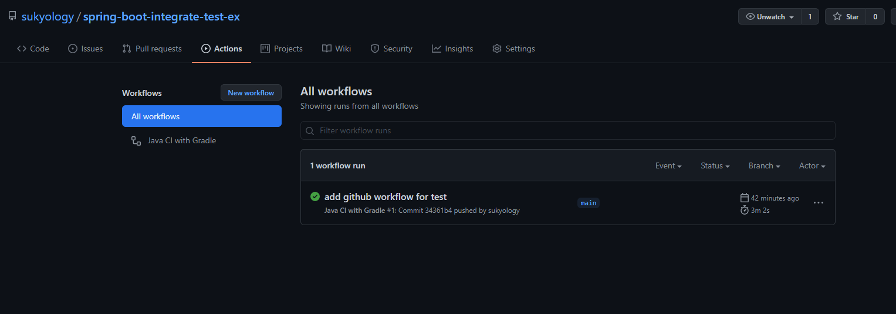

> 해당 post의 개선 사항을 [새로운 글]()에 올렸습니다.
> 새로운 글을 적고보니 반말로 썼군요. 앞으로는 존댓말로 쓰겠습니다. 이글을 읽고 불편했던 분들이 있었다면 죄송합니다. 

### 기존 상황

> 로컬 DB를 사용하여 스프링 통합 테스트를 하고 있었다. 
>
> 개발망에 서버를 올리고, 추가적인 테스트를 하고 있었다.


### 목적

> 코너케이스나 데이터 정합성까진 아니더라도 
> 기본적인 api의 동작 여부는 코드가 변경될 때 마다 자동으로 체크하고 싶다.


### 해결 방법

- [x] db의 멱등성 부여
  - [ ] docker container를 테스트마다 생성함. 
- [x] 자동으로 체크
  - [ ] github actions를 통해 풀리퀘나 푸시가 일어날 때 마다 테스트코드 실행
- [x] api 동작 여부 체크
  - [ ] testResttemplate으로 실행 spring 서버에 api 요청


### 구체적인 설정


#### dependency 설정

`build.gradle.kts`

```kotlin
dependencies {
    //...
    //기본적인 spring test dependencies 존재 가정
    testImplementation("org.testcontainers:junit-jupiter")
    testImplementation("org.testcontainers:postgresql")
}

val testContainerVersion by extra {
    "1.15.1"
}

dependencyManagement {
    imports {
        mavenBom("org.testcontainers:testcontainers-bom:$testContainerVersion")
    }
}
```

위의 내용을 통해 junit 테스트 시에 테스트 생명 주기 안에서 container를 띄우는 방법을 제공한다.


#### test 용 spring 설정

어떤 방식으로 만들어도 상관없다. 개인적으로 test용 spring yml 파일을 별도로 만들어서 설정했다. 

```yaml
spring:
  datasource:
    hikari:
      username: postgres
      password: 1234
    # 컨테이너로 띄운 postgresql db 접속 url (test-database는 나중에 test class 설정과 db 이름이 같아야 한다.)
    url: jdbc:tc:postgresql:///test-database?stringtype=unspecified
    # 컨테이너로 띄운 postgresql 접속할 때 쓰는 driver, 기존 postgresql 드라이버는 동작하지 않는다.
    driver-class-name: org.testcontainers.jdbc.ContainerDatabaseDriver
  jpa:
    hibernate:
      ddl-auto: create
    # 10을 쓸 때 @generated을 안 쓸 때는 문제가 없었는데, @Generated를 쓰니까 ddl 문에서 에러가 났다. 
    database-platform: org.hibernate.dialect.PostgreSQL9Dialect
    show-sql: true
```


#### test class 설정

```kotlin
@SpringBootTest(webEnvironment = SpringBootTest.WebEnvironment.RANDOM_PORT)
@TestPropertySource(properties = ["spring.profiles.active=test"]) // can override any propertysource
@TestConstructor(autowireMode = TestConstructor.AutowireMode.ALL) // autowire without @autowired
class SpringBootIntegrateTestExApplicationTests(
    private val restTemplate: TestRestTemplate
) {

    @Test
    @Transactional
    fun contextLoads() {
        println("context loads")
        // 실제 스프링에 구현되어 있는 컨트롤러 url을 스펙에 맞춰서 호출한다.
        // 나는 해당 url을 호출하면 entity 하나를 자동 생성하는 api를 만들었다. 
        val response = restTemplate.postForObject<TeamResponse>("/team")
        // 자동 생성이고, 테스트마다 db를 생성하기 때문에 매번 1이 출력된다.
        println(response?.id)

    }

    // 해당 static 변수를 설정해야 컨테이너를 띄운다. 
    // database 이름은 하기의 이름과 yml 설정에서 같게 만든다. 
    companion object {
        @JvmStatic
        protected val dbContainer = PostgreSQLContainer<Nothing>("postgres:latest").apply {
            withDatabaseName("test-database")
        }

        init {
            dbContainer.start()
        }
    }
}
```


#### github action 설정

1. git 프로젝트 모듈 최상단에 .github 폴더를 만든다. 
2. 그 폴더 안에 workflows 폴더를 만든다. 
3. 아무 이름으로 *.yml 파일을 만든다. 



[^]: 위와 같은 폴더 구조가 되어야 한다.


4. 해당 파일 안에 테스트 스텝을 하기와 같이 설정한다. 

```yaml
name: Java CI with Gradle # 이름은 아무렇게나 지어도 된다.

on: # Event
  push:
    branches: [ develop, main ] # 본인이 푸시하는 브랜치 설정
#  pull_request:
#    branches: [ master, develop ] 풀리퀘도 하는 브랜치고, 그때마다 체크하고 싶은 거면 이것도 설정

jobs:
  test: # Job id
    runs-on: ubuntu-latest # Runner
    steps:
      - uses: actions/checkout@v2 # Step
      - name: Set up JDK 11
        uses: actions/setup-java@v1
        with:
          java-version: 11 # 원하는 자바 버젼을 기입.
      - uses: actions/cache@v2
        with:
          path: |
            ~/.gradle/caches
            ~/.gradle/wrapper
          key: ${{ runner.os }}-gradle-${{ hashFiles('**/*.gradle*') }}
          restore-keys: |
            ${{ runner.os }}-gradle-
      - name: Grant execute permission for gradlew
        run: chmod +x ./gradlew # !!!gradlew가 있는 위치를 정확히 기입!!!
      - name: Test with Gradle
        run: |
          ./gradlew test # !!!gradlew가 있는 위치를 정확히 기입!!!
```


#### 확인

설정하고 깃에 푸시를 했을 경우 



이런 식으로 리파지토리 actions 탭에 뭐(?)가 생겨야 한다.


https://github.com/sukyology/spring-boot-integrate-test-ex <= 예제 코드


> 아... 참고로 로컬에서 돌려보고 싶으면 docker daemon이 pc에서 돌고 있어야 한다. 설치 방법은 검색하면 나온다. ^^


-끝-